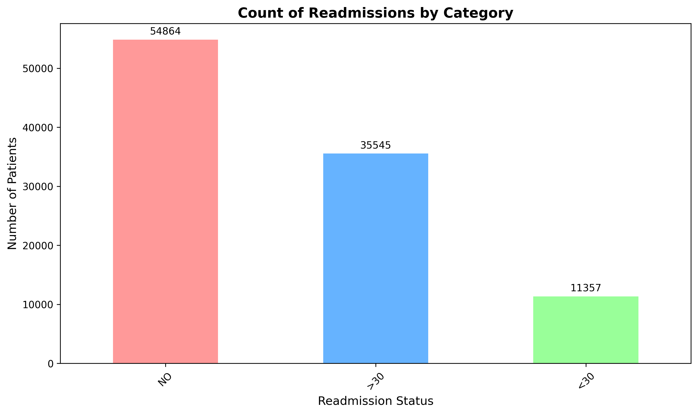
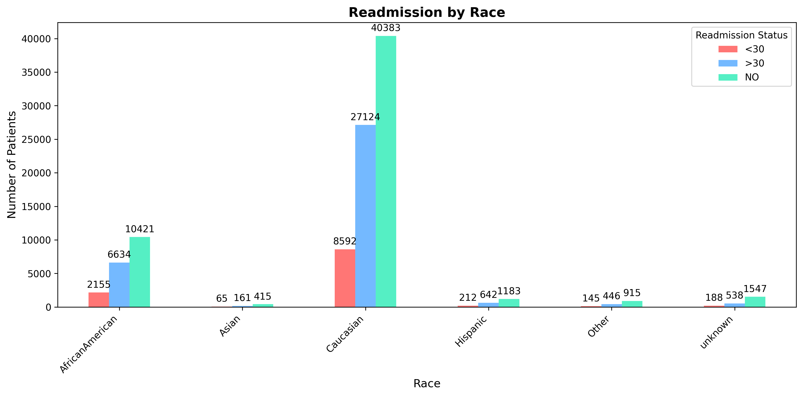
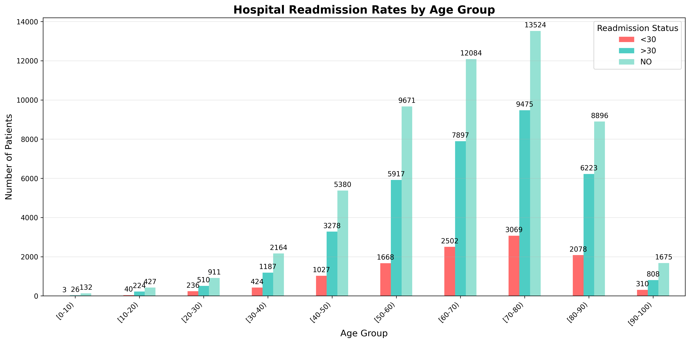
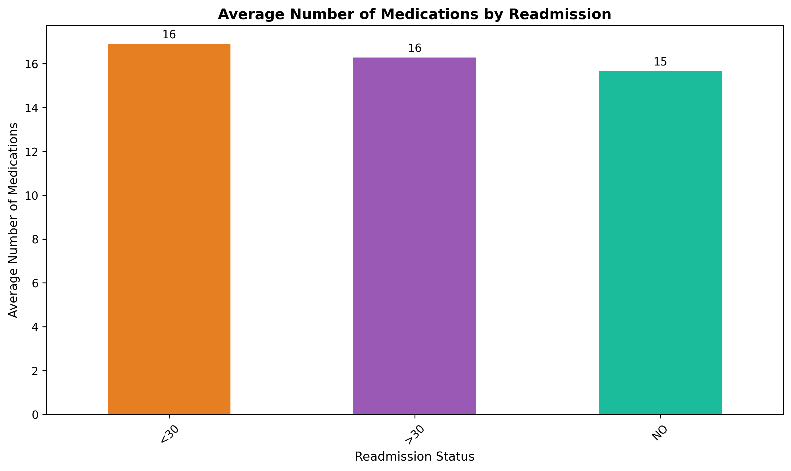

# Exploratory Data Analysis Report
## Hospital Readmission Prediction for Diabetes Patients

**Author:** Eduardo Yaguar 

**Date:** November 4, 2025 

**Course:** Intelligent Systems

**Institution:** Universidad Espíritu Santo (UEES)

---
## Table of Contents
1. [Introduction](#introduction)
2. [Dataset Description](#dataset-description)
3. [Data Cleaning](#data-cleaning)
4. [Data Manipulation](#data-manipulation)
5. [Univariate Analysis](#univariate-analysis)
6. [Bivariate Analysis](#bivariate-analysis)
7. [Multivariate Analysis](#multivariate-analysis)
8. [Data Visualizations Analysis](#data-visualizations-analysis)
---
## Introduction

This exploratory data analysis aims to accomplish the following  objectives:
- Understand dataset structure
- Clean and prepare data for the model
- Discover relationships and patterns
- Identify important features

---
## Dataset Description

### Data Source

**Dataset:** Diabetes 130-US Hospitals (1999-2008)  
**Source:** UCI Machine Learning Repository  
**URL:** https://archive.ics.uci.edu/dataset/296/

### Characteristics

| Characteristic | Value |
|----------------|-------|
| Total Records | 101,766 encounters |
| Total Features | 50 variables |
| Time Period | 1999-2008|
| Number of Hospitals | 130 US hospitals |
| Patient Type | Diabetic inpatients |
| Unique Patients | ~71,000 individuals |

### Clasification of Features and Related Information

The following features were clasificated into the next sections for the purpose of the EDA:

#### Demographics (4 features)
- `race` - Patient's race (Caucasian, AfricanAmerican, Hispanic, Asian, Other)
- `gender` - Male/Female
- `age` - Age group in 10-year intervals ([0-10), [10-20), ..., [90-100))
- `weight` - Weight in pounds (high missing rate)

#### Admission Information (3 features)
- `admission_type_id` - Type of admission (Emergency, Urgent, Elective, etc.)
- `discharge_disposition_id` - Where patient went after discharge
- `admission_source_id` - Where patient came from (ER, Physician referral, etc.)

#### Clinical Metrics (8 features)
- `time_in_hospital` - Days spent in hospital (1-14)
- `num_lab_procedures` - Number of lab tests performed
- `num_procedures` - Number of procedures (non-lab)
- `num_medications` - Number of distinct medications administered
- `number_outpatient` - Outpatient visits in year before encounter
- `number_emergency` - Emergency visits in year before encounter
- `number_inpatient` - Inpatient visits in year before encounter
- `number_diagnoses` - Number of diagnoses entered (1-16)

#### Diagnosis Codes (3 features)
- `diag_1` - Primary diagnosis (ICD-9 codes)
- `diag_2` - Secondary diagnosis
- `diag_3` - Additional secondary diagnosis

#### Medications (24 features)
Diabetes medications including:
- Metformin, Repaglinide, Nateglinide
- Glimepiride, Glipizide, Glyburide
- Insulin and various combinations
- Values: No, Up, Down, Steady (indicating dosage changes)

#### Other Features (8 features)
- `payer_code` - Insurance type
- `medical_specialty` - Specialty of admitting physician
- `max_glu_serum` - Glucose serum test result
- `A1Cresult` - HbA1c test result
- `change` - Whether medications were changed
- `diabetesMed` - Whether diabetes medication was prescribed

#### Target Variable
- `readmitted` - **NO** (not readmitted), **<30** (readmitted within 30 days), **>30** (readmitted after 30 days)
---
## Data Cleaning

### Missing Values Analysis
The dataset uses **'?'** to represent missing values

**Missing Value Summary:**

| Feature | Missing Count | Percentage |
|---------|---------------|------------|
| weight | 98,569 | ~97% |
| payer_code | 40,256 | ~40% |
| medical_specialty | 49,949 | ~49% |
| race | 2,273 | ~2% |
| diag_1 | 21 | ~0.2% |
| diag_2 | 358 | ~0.4% |
| diag_3 | 1,423 | ~1.4% |

**Key Findings:**

- **Weight** High missing rate (97%)
- **Medical_specialty** Is missing in nearly half of cases
- **Payer_code** High missing values related with insurance documentation
- **Race** Minimal missing values
- **Diagnosis codes** Mostly complete 

### Duplicate Records

| Check Type | Count |
|------------|-------|
| Exact duplicate rows | 0 |
| Duplicate patient_nbr | 30,248 |

Approximately 30,248 patient numbers appear multiple times, indicating that many patients had multiple hospital encounters during the study period.

### Outliers

**Interquartile Range (IQR) method**

| Feature | Outliers | Percentage |
|---------|----------|------------|
| time_in_hospital | 2,252 | ~2.2% |
| num_lab_procedures | 143 | ~0.1% |
| num_procedures | 4954 | ~4.86% |
| num_medications | 2557 | ~2.5% |
| number_outpatient |16739 | ~16.4% |
| number_emergency | 11383 | ~11% |
| number_inpatient | 7049 | ~7% |
| number_diagnoses | 281 | ~0.2% |

**Interpretation:**

- **Low outliers (<5%)** in lab procedures, diagnoses, medications, and hospital stay indicate mostly normal clinical variation
- **High outliers (>10%)** in outpatient and emergency visits suggest a significant subset of frequent healthcare utilizers
- These frequent utilizers may represent chronic disease patients at higher risk for readmission

### Data Issues

**Age Feature:**

The `age` feature is stored as categorical intervals rather than continuous numeric values:
- [0-10), [10-20), [20-30), ..., [90-100)

Need to handle as ordinal categorical variable

## Data Manipulation
Based on the missing value analysis I implemented the next strategy applied to all categorical variables with missing values.

**Features Affected:**
1. `weight` - 97% missing - 'Unknown'
2. `payer_code` - 40% missing - 'Unknown'
3. `medical_specialty` - 49% missing - 'Unknown'
4. `race` - 2% missing - 'Unknown'
5. `diag_2`, `diag_3` - 2% missing - 'Unknown'

**Justification:**

By following this approach I ensure to retain 100% of the records in the dataset and help with the data interpretation.

| Feature | Justification |
|---------|---------------|
| weight | Too many missing values (97%) for meaningful imputation. |
| payer_code | Missing possibly indicates uninsured or unknown insurance status|
| medical_specialty | Absence may indicate general admission or emergency without specialist - meaningful distinction. |
| race | Small percentage missing; 'Unknown' preserves information without introducing bias. |
| diagnosis codes | Absence indicates fewer diagnosed conditions |

## Univariate Analysis

### Target Variable: Readmitted

**Distribution:**

| Category | Count | Percentage |
|----------|-------|------------|
| NO | 54,864 | ~54% |
| >30 | 35,545 | ~35.0% |
| <30 | 11,357 | ~11% |

**Key Observations:**

**Class Imbalance:** The dataset shows significant imbalance
- Majority class (NO): ~54%
- Minority class (<30): ~11%
- Ratio: approximately 5:1
- Early readmission (<30 days) is the most critical to predict

---

## Bivariate Analysis

### Readmission vs Age

**Readmission Rate by Age Group:**

| Age Group | <30 | >30 | NO |
|-----------|-----|------|------|
| [0-10) | 1.86% | 16.15% | 81.99% |
| [10-20) | 5.79% | 32.42% | 61.79% |
| [20-30) | 14.24% | 30.78% | 54.98% |
| [30-40) | 11.24% | 31.44% | 57.32% |
| [40-50) | 10.60% | 33.85% | 55.55% |
| [50-60) | 9.67% | 34.29% | 56.04% |
| [60-70) | 11.13% | 35.12% | 53.75% |
| [70-80) | 11.77% | 38.35% | 51.88% |
| [80-90) | 12.08% | 36.19% | 51.73% |
| [90-100) | 11.10% | 28.93% | 59.97% |

**Interpretation:**

- **Lowest readmission:** Very young patients (0-10 years) show only 18% total readmission rate
- **Highest readmission:** Elderly patients (70-80 years) show highest readmission rate
- **Early readmission (<30 days):** Peak at ages 10-20 (32.42%), then stabilizes around 10-12%
- **Late readmission (>30 days):** Increases steadily with age, peaking at 70-80 years (38.35%)
- **Pattern:** Readmission risk increases with age, with elderly (60-90) being highest risk group

### Readmission vs Time in Hospital

**Average Hospital Stay by Readmission Status:**

| Readmission Status | Mean Days | Median Days | Std Dev |
|--------------------|-----------|-------------|---------|
| <30 | 4.77 | 4.0 | 3.03 |
| >30 | 4.50 | 4.0 | 2.99 |
| NO | 4.25 | 3.0 | 2.96 |

**Key Findings:**

1. **Early readmission patients (<30 days):**
   - Longest average stay (4.77 days)
   - 12% longer than non-readmitted patients
   - Higher variability (std dev = 3.03)
   - Median = 4.0 days

2. **Late readmission patients (>30 days):**
   - Moderate stay length (4.50 days)
   - 6% longer than non-readmitted
   - Std dev = 2.99
   - Median = 4.0 days

3. **Non-readmitted patients (NO):**
   - Shortest average stay (4.25 days)
   - Lower median (3.0 days) suggests faster discharge
   - Lowest variability (std dev = 2.96)

### Readmission vs Number of Medications

**Average Medications by Readmission Status:**

| Readmission Status | Mean | Median | Std Dev |
|--------------------|------|--------|---------|
| <30 | 16.90 | 16.0 | 8.10 |
| >30 | 16.28 | 15.0 | 7.62 |
| NO | 15.67 | 14.0 | 8.43 |

**Key Findings:**

1. **Positive correlation:** More medications means higher readmission risk. But the std dev is high so results can have a huge variation.
2. **Early readmission patients (<30 days):**
   - Highest medication count: 16.90 medications on average
   - 7.8% more medications than non-readmitted patients
   - Median of 16 medications
3. **Late readmission patients (>30 days):**
   - Moderate medication count: 16.28 medications
   - 3.9% more than non-readmitted
   - Median of 15 medications
4. **Non-readmitted patients (NO):**
   - Lowest medication count: 15.67 medications
   - Median of 14 medications
   - Highest variability (std dev = 8.43)

### Readmission vs Diabetes Medication

**Readmission Rate by Diabetes Medication Status:**

| Diabetes Med | <30 | >30 | NO | Total Readmitted |
|--------------|-----|------|------|------------------|
| No | 9.60% | 30.88% | 59.52% | 40.48% |
| Yes | 11.63% | 36.14% | 52.24% | 47.76% |

**Key Findings:**

1. **Patients ON diabetes medication (Yes):**
   - 47.76% total readmission rate
   - 11.63% early readmission (<30 days)
   - 36.14% late readmission (>30 days)
   - Higher risk across all readmission categories

2. **Patients NOT on diabetes medication (No):**
   - 40.48% total readmission rate
   - 9.60% early readmission (<30 days)
   - 30.88% late readmission (>30 days)
   - Lower readmission rates overall

3. **Difference analysis:**
   - 7.3% higher total readmission for patients on diabetes medication
   - 21% higher early readmission rate
   - 17% higher late readmission rate

### Readmission vs Gender

**Readmission Rate by Gender:**

| Gender | <30 | >30 | NO | Total Readmitted |
|--------|-----|------|------|------------------|
| Female | 11.25% | 35.68% | 53.08% | 46.92% |
| Male | 11.06% | 34.06% | 54.88% | 45.12% |
| Unknown/Invalid | 0.00% | 0.00% | 100.00% | 0.00% |

**Interpretation:**

- Minimal gender impact, the difference between genders is less than 2%
- Gender is not a strong predictor of readmission in this dataset
- Both genders show similar readmission patterns

### Readmission vs Race

**Readmission Rate by Race:**

| Race | <30 | >30 | NO | Total Readmitted |
|------|-----|------|------|------------------|
| AfricanAmerican | 11.22% | 34.53% | 54.25% | 45.75% |
| Asian | 10.14% | 25.12% | 64.74% | 35.26% |
| Caucasian | 11.29% | 35.64% | 53.07% | 46.93% |
| Hispanic | 10.41% | 31.52% | 58.08% | 41.92% |
| Other | 9.63% | 29.61% | 60.76% | 39.24% |
| Unknown | 8.27% | 23.67% | 68.06% | 31.94% |

**Key Findings:**

1. **Caucasian patients:**
   - Highest total readmission rate: 46.93%
   - 11.29% early readmission (<30 days)
   - 35.64% late readmission (>30 days)

2. **African American patients:**
   - Second highest readmission rate: 45.75%
   - 11.22% early readmission (<30 days)
   - 34.53% late readmission (>30 days)

3. **Asian patients:**
   - Lowest readmission rate among major groups: 35.26%
   - 10.14% early readmission (<30 days)
   - 25.12% late readmission (>30 days)
   - 33% lower readmission than Caucasian patients

4. **Hispanic patients:**
   - Moderate readmission rate: 41.92%
   - Lower than Caucasian and African American
   - 10.41% early readmission (<30 days)

5. **Unknown race:**
   - Not considered for the analysis

## Multivariable Analysis

### Correlation Analysis (Numerical Variables)

|                      | time_in_hospital | num_lab_procedures | num_procedures | num_medications | number_outpatient | number_emergency | number_inpatient | number_diagnoses |
|----------------------|------------------|-------------------|----------------|-----------------|-------------------|------------------|------------------|------------------|
| **time_in_hospital** | 1.000000         | 0.318450          | 0.191472       | 0.466135        | -0.008916         | -0.009681        | 0.073623         | 0.220186         |
| **num_lab_procedures** | 0.318450       | 1.000000          | 0.058066       | 0.268161        | -0.007602         | -0.002279        | 0.039231         | 0.152773         |
| **num_procedures**   | 0.191472         | 0.058066          | 1.000000       | 0.385767        | -0.024819         | -0.038179        | -0.066236        | 0.073734         |
| **num_medications**  | 0.466135         | 0.268161          | 0.385767       | 1.000000        | 0.045197          | 0.013180         | 0.064194         | 0.261526         |
| **number_outpatient** | -0.008916       | -0.007602         | -0.024819      | 0.045197        | 1.000000          | 0.091459         | 0.107338         | 0.094152         |
| **number_emergency** | -0.009681        | -0.002279         | -0.038179      | 0.013180        | 0.091459          | 1.000000         | 0.266559         | 0.055539         |
| **number_inpatient** | 0.073623         | 0.039231          | -0.066236      | 0.064194        | 0.107338          | 0.266559         | 1.000000         | 0.104710         |
| **number_diagnoses** | 0.220186         | 0.152773          | 0.073734       | 0.261526        | 0.094152          | 0.055539         | 0.104710         | 1.000000         |

- Overall weak correlations between numerical variables
- Strongest correlation: time_in_hospital vs num_medications (0.46)
    - Longer stays require more medications
- Moderate correlations:
    - num_procedures vs num_medications (0.38)
    - time_in_hospital vs num_lab_procedures (0.31)
- Most variables show independence (correlations < 0.3)

## Multivariate Analysis

### Age - Diabetes Medication - Readmission

**For patients WITH diabetes medication**

| Age Group | <30 | >30 | NO | Total Readmitted |
|-----------|-----|------|------|------------------|
| [0-10) | 2.26% | 17.29% | 80.45% | 19.55% |
| [10-20) | 6.17% | 33.17% | 60.67% | 39.33% |
| [20-30) | 15.44% | 31.18% | 53.38% | 46.62% |
| [30-40) | 11.86% | 33.13% | 55.00% | 45.00% |
| [40-50) | 11.06% | 35.00% | 53.94% | 46.06% |
| [50-60) | 10.04% | 35.18% | 54.79% | 45.21% |
| [60-70) | 11.37% | 36.11% | 52.52% | 47.48% |
| [70-80) | 12.12% | 37.67% | 50.21% | 49.79% |
| [80-90) | 12.99% | 37.90% | 49.10% | 50.90% |
| [90-100) | 12.24% | 29.58% | 58.18% | 41.82% |

**For patients WITHOUT diabetes medication**

| Age Group | <30 | >30 | NO | Total Readmitted |
|-----------|-----|------|------|------------------|
| [0-10) | 0.00% | 10.71% | 89.29% | 10.71% |
| [10-20) | 3.30% | 27.47% | 69.23% | 30.77% |
| [20-30) | 9.65% | 29.24% | 61.11% | 38.89% |
| [30-40) | 9.29% | 26.24% | 64.47% | 35.53% |
| [40-50) | 9.12% | 30.09% | 60.79% | 39.21% |
| [50-60) | 8.38% | 31.21% | 60.42% | 39.58% |
| [60-70) | 10.26% | 31.55% | 58.19% | 41.81% |
| [70-80) | 10.57% | 31.81% | 57.63% | 42.37% |
| [80-90) | 9.34% | 31.01% | 59.65% | 40.35% |
| [90-100) | 8.48% | 27.44% | 64.08% | 35.92% |

**Key Insights:**

1. **Dramatic difference by medication status:**
   - **Patients on diabetes medication:** Up to 50.90% readmission rate (age 80-90)
   - **Patients without medication:** Maximum 42.37% readmission rate (age 70-80)
   - Difference of up to 10.5% in elderly patients

2. **Age pattern with diabetes medication:**
   - Steady increase in readmission from age 20 to 80-90
   - Peak readmission at 80-90 years: 50.90%
   - Early readmission (<30) increases from 11-13% in middle/elderly ages
   - Late readmission (>30) peaks at 37.90% in 80-90 age group

3. **Highest risk groups:**
   - 80-90 years with diabetes medication equals 50.90% readmission
   - 70-80 years with diabetes medication equals 49.79% readmission

### Admission Type and Readmission

**Readmission Rate by Admission Type:**

| Admission Type ID | Description | <30 | >30 | NO | Total Readmitted |
|-------------------|-------------|-----|------|------|------------------|
| 1 | Emergency | 11.52% | 35.76% | 52.73% | 47.27% |
| 2 | Urgent | 11.18% | 34.91% | 53.91% | 46.09% |
| 3 | Elective | 10.39% | 30.45% | 59.16% | 40.84% |
| 4 | Newborn | 10.00% | 20.00% | 70.00% | 30.00% |
| 5 | Not Available | 10.34% | 35.97% | 53.69% | 46.31% |
| 6 | NULL | 11.08% | 42.17% | 46.76% | 53.24% |
| 7 | Trauma Center | 0.00% | 0.00% | 100.00% | 0.00% |
| 8 | Not Mapped | 8.44% | 26.25% | 65.31% | 34.69% |

**Key Findings:**

1. **NULL admission type (6):**
   - Highest total readmission rate: 53.24%
   - Highest late readmission (>30): 42.17%
   - Data quality issue

2. **Emergency admissions (1):**
   - Second highest readmission rate: 47.27%
   - 11.52% early readmission (<30 days)
   - 35.76% late readmission (>30 days)
   - Reflects acute, unstable conditions

3. **Urgent admissions (2):**
   - Similar to emergency: 46.09% total readmission
   - 11.18% early readmission

4. **Elective admissions (3):**
   - Best outcomes among major categories: 40.84% readmission
   - Lowest early readmission: 10.39%
   - 30.45% late readmission

5. **Newborn admissions (4):**
   - Lowest readmission: 30.00%
   - Very small sample size
   - Not representative for general analysis

6. **Trauma Center (7):**
   - Data quality issue

7. **Not Available/Not Mapped (5, 8):**
   - Data quality issue

## Data Visualizations Analysis

### Correlation Matrix 

The heatmap reveals moderate positive correlations between time in hospital and both number of medications (0.47) and number of lab procedures (0.32). Number of medications also shows moderate correlation with number of procedures (0.39). Most variables show weak correlations with each other.

###  Distribution of Patient Readmissions (Pie Chart)

The majority of patients (53.9%) were not readmitted. However, 46.1% experienced readmission, with 34.9% readmitted after 30 days and 11.2% readmitted within 30 days. This implies that the majority of patients has experienced readmission

### Count of Readmissions by Category (Bar Chart)

The following chart shows 54,864 patients not readmitted (NO), 35,545 readmitted after 30 days (>30), and 11,357 readmitted within 30 days (<30). This reinforces the readmission pattern observed in the pie chart.

### Readmission by Race

Caucasian patients represent the largest group across all readmission categories, followed by African American patients. The pattern of readmission appears consistent across racial groups, with no race showing dramatically different readmission proportions relative to their overall representation.

### Readmission by Gender

Both female and male patients show similar readmission patterns. Females show slightly higher absolute numbers (29,038 not readmitted vs 25,823 for males), but the proportional distribution across readmission categories appears balanced between genders. For a better understanding could be useful to take in consideration the age of the females, since females tend to live more years than males, so readmission could be higher in elder population.

### Readmission by Diabetes Medication Status

Patients prescribed diabetes medication show higher numbers and clearly indicates a tendency. Patients with diabetes medication prescribed are more likely to have a readmission almost a 3:1 relation with no prescribed patients.

### Hospital Readmission Rates by Age Group

Readmission rates increase with age, peaking in the 70-80 age group (13,524 readmitted). Younger age groups (0-40) show less readmissions, while patients over 50 demonstrate markedly higher readmission rates, indicating age as a significant risk factor.

### Average Number of Medications by Readmission

Patients readmitted within 30 days and after 30 days average 16 medications, while those not readmitted average 15 medications. The minimal difference suggests medication count alone may not be a strong predictor of readmission.